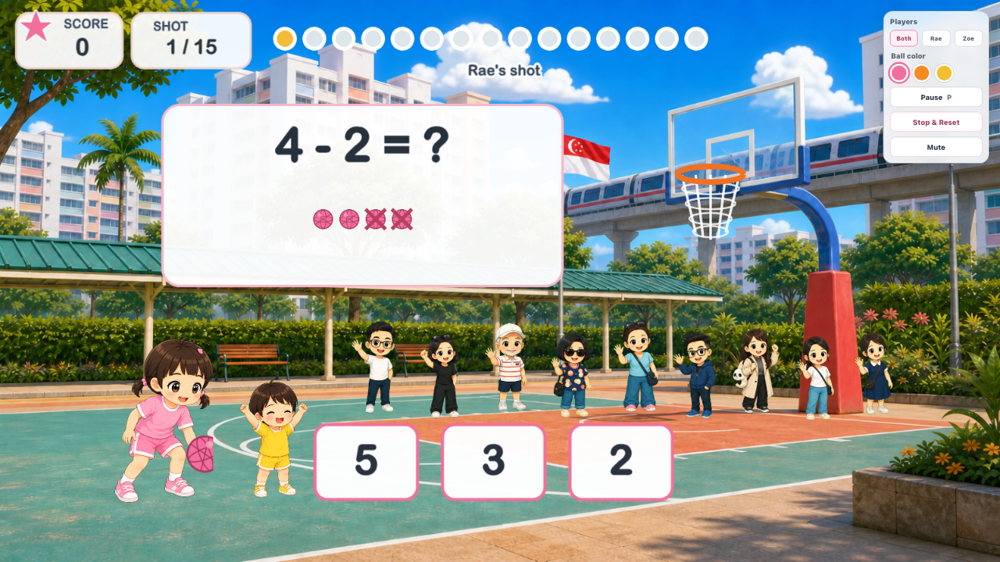
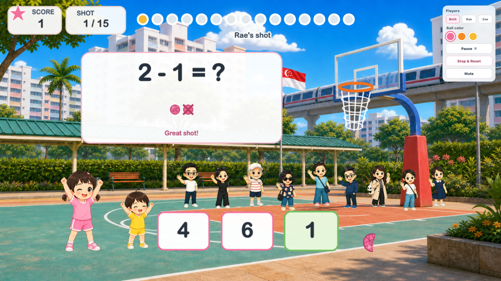
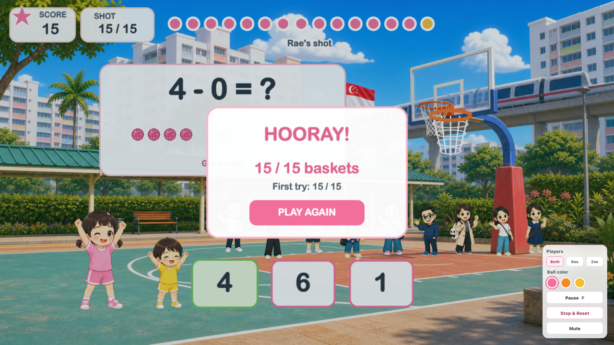

# Math Basketball

An animated early-mathematics basketball game for young children, set on a
sunny Singapore HDB neighborhood court.

[Play Math Basketball](https://basketballmath.vercel.app)

Rae and Zoe learn through movement: count the mini basketballs, choose an
answer, and watch the active player take the shot. A correct answer swishes
through the hoop and moves the net. A wrong answer bounces off the rim, reveals
the correct answer, and gives the same child another try.

## Preview







## Why It Works For Young Learners

- **Small-number curriculum:** every operand and answer stays between `0` and
  `10`, and subtraction never produces a negative result.
- **Visual counting support:** addition shows two groups of mini basketballs;
  subtraction starts with one group and visibly crosses out the balls being
  removed.
- **Gentle introduction to zero:** each 15-question game contains at most one
  zero-concept question, so ordinary counting practice remains the focus.
- **Retry without penalty:** an incorrect answer shows the correct answer and
  lets the same child try again.
- **Audio guidance:** the game reads each equation aloud and provides spoken
  feedback after every attempt.
- **Large interaction targets:** three answer buttons and a high-contrast custom
  pointer make the game easier for small hands to follow.

## Gameplay

Each game contains 15 newly randomized addition and subtraction questions.

1. Choose `Rae`, `Zoe`, or `Rae + Zoe`.
2. Choose a pink, orange, or yellow basketball. Pink is the default.
3. Count the mini basketball cues and select one of three answers.
4. Watch the active player dribble, gather, release, and shoot.
5. Complete all 15 baskets and review the first-try score.

In pair mode, Rae and Zoe rotate after every completed question.

## Animation And Sound

The court is built as an interactive scene rather than a static quiz screen.

- Rae and Zoe use sports-attire pose sequences for dribbling, gathering,
  releasing, and celebrating.
- The selected basketball follows a curved shot path, spins in flight, bounces
  naturally on misses, and continues onto the floor after a basket.
- The single hoop is attached to the court backboard and its net moves on a
  successful swish.
- Family supporters wave from the sideline and celebrate each made basket.
- The Web Audio API provides music, rim, bounce, and swish effects.
- The browser Speech Synthesis API narrates questions and feedback.

## Parent Controls

The compact top-right panel stays clear of the cheering family:

- Switch between `Both`, `Rae`, and `Zoe`.
- Choose a pink, orange, or yellow basketball.
- Pause or resume the game.
- Stop and reset the current round.
- Mute or restore audio.

## Tech Stack

| Layer | Technology | Purpose |
| --- | --- | --- |
| UI shell | React 19 + TypeScript | Parent controls, responsive layout, and fullscreen behavior |
| Game engine | Phaser 3 | Court scene, animation timing, input handling, and runtime textures |
| Build tooling | Vite 8 | Fast local development and optimized production builds |
| Audio | Web Audio API + Speech Synthesis API | Music, sound effects, and narrated guidance |
| Styling | CSS | Responsive landscape layout, portrait rotation hint, and custom pointer |
| QA | Playwright | End-to-end gameplay regression and visual verification |
| Hosting | Vercel | Production deployment |

## Run Locally

```bash
npm install
npm run dev
```

Open [http://127.0.0.1:5176/](http://127.0.0.1:5176/).

Create a production build:

```bash
npm run build
```

Run the local end-to-end regression while the dev server is active:

```bash
npx playwright install chromium
npm run qa
```

The Playwright browser installation is only required once per development
machine.

## Verification

The checked gameplay path covers:

- Start overlay and first dribble.
- Wrong-answer rim bounce, correct-answer reveal, and same-child retry.
- Correct-answer swish and moving net.
- Rae and Zoe rotation in pair mode.
- Pink, orange, and yellow basketball selection.
- Rae-only and Zoe-only modes.
- Portrait rotation guidance.
- Complete 15-question game and recap.
- Eighty generated game sets with no more than one zero-concept question each.

## Project Structure

```text
src/
  App.tsx                       React shell and parent controls
  styles.css                    Responsive layout and custom pointer
  game/
    BasketballScene.ts          Phaser court, animations, and game loop
    questions.ts                Randomized early-mathematics curriculum
    AudioGuide.ts               Music, sound effects, and narration
    createMathBasketballGame.ts Phaser setup
public/assets/
  backgrounds/                  Singapore HDB basketball-court art
  npcs/                         Animated family supporters
  players/                      Sports-attire Rae and Zoe pose frames
  ui/                           Large custom pointer
docs/media/                      README preview images
scripts/
  extract_player_frames.py      Generated-strip normalization helper
  qa_game.mjs                   End-to-end local Chromium verification
```

## Design Direction

Math Basketball is a standalone sibling project inspired by the visual language
of the Healthier Food Choice game. It preserves Rae, Zoe, and the family
supporters while giving the children sports attire, toy-free poses, and a
dedicated basketball learning environment.
